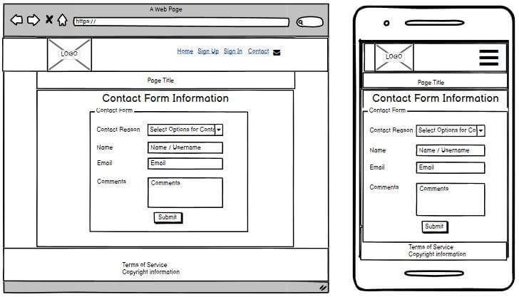
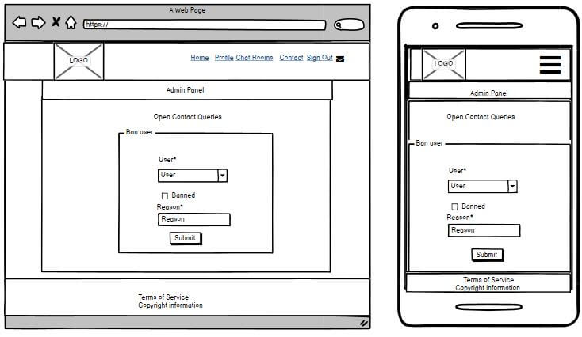
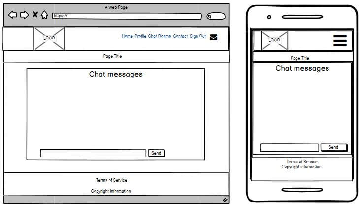
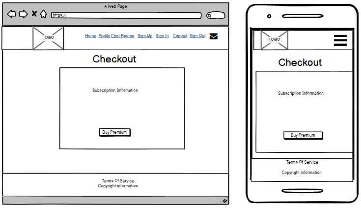
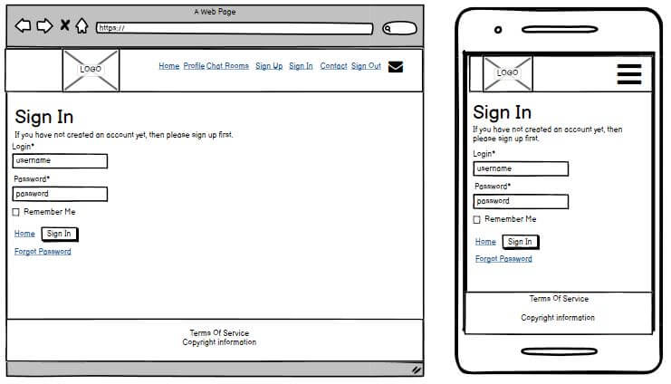
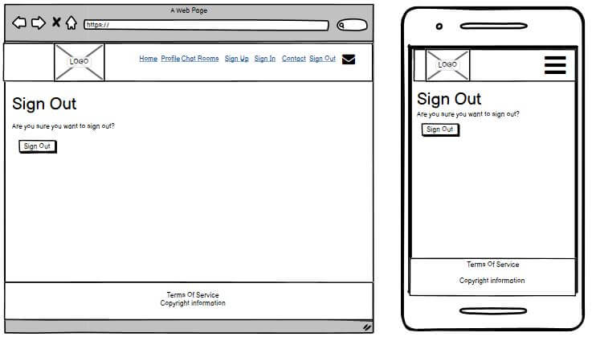

# Chat To The Mat
Chat To The Mat is an online chat service where users can create online friendships. A premium subscription service 
is available to users that allows access to our 'Gold Rooms' and enables the private messaging functionality. The live website can be found [here](https://chat-to-the-mat.herokuapp.com/). 

## Table of Contents
* [User Experience Design (UX)](#User-Experience-Design)
    * [The Strategy Plane](#The-Strategy-Plane)
        * [Site Goals](#Site-Goals)
        * [User stories](#User-Stories)
    * [The Scope Plane](#The-Scope-Plane)
    * [The Structure Plane](#The-Structure-Plane)
    * [The Skeleton Plane](#The-Skeleton-Plane)
        * [Wireframes](#Wireframes)
        * [Database Design](#Database-Design)
        * [Security](#Security)
    * [The Surface Plane](#The-Surface-Plane)
        * [Design](#Design)
            * [Colour Scheme](#Colour-Scheme)
            * [Typography](#Typography)
            * [Imagery](#Imagery)
- [Features](#Features)
    * [Existing Features](#Existing-Features)
    * [Future Features](#Features-Left-to-Implement)
* [Technologies](#Technologies)
* [Testing](#Testing)
    * [Test Strategy](#Test-Strategy)
    * [Test Results](#Test-Results)
* [Deployment](#Deployment)
    * [Project Creation](#Project-Creation)
    * [Heroku Deployment](#Deployment-To-Heroku)
    * [Run Locally](#Run-Locally)
    * [Fork Project](#Fork-Project)
* [Credits](#Credits)
  * [Content](#Content)
  * [Acknowledgements](#Acknowledgements)

****

## User Experience Design
### **The Strategy Plane**
Chat To The Mat is the idea of client Sarah C who would like her own chat application that is designed to her requirements. During the 
global pandemic of Covid-19, Sarah has found herself quite lonely and although there are many chat applications available, she has failed 
to find one she enjoys.

Sarah would like the application to have a premium subscription service where she can chat with other people from around the globe who are 
also serious about building deep friendships whilst also offering limited availability to non subscription users. One of the things she 
worries about is people abusing the website and other users, so she would like to be able to appoint moderators who have the ability to 
ban users who post malicious or abusive content, that spam or cause general upset with the other chat users.

The aim is to build a responsive chat application where only registered users can enter the chat rooms. Security features will be implemented 
and users must be verified before being able to access the main functionality of the site. User groups will be created in order to allow 
moderators to ban users who break the terms of conditions outlined for the site. Additional groups will be created that allow access to premium 
features and areas of the site that are available once a paid subscription has been processed.

#### Site Goals
* To give users a friendly chat environment that they can use to build online friendships. 
* To ensure that moderators are in place so that users can report any bullying, harrassment or offensive content.
* To offer premium subscription services to users in order to monetize the website for the owners profit.

#### User stories
* As a user, I want the main purpose of the site to be clear so that I immediately know what the site is intended for upon entering.
* As a user, I want to easily navigate the site so that I can find content quickly with ease on any device.
* As a user, I want to be able to chat with other users in the chatroom in a safe and moderated environment.
* As a user, I want to have the option of a subscription to access premium content that I may be interested in.
* As a user, I want to be able to contact the staff of the website incase I have any issues with the site or encounter issues with other users.
* As a user, I want to be in control of my account information and have the option to update my personal information or delete my account.

* As a premium user, I want to be able to private chat with other members so that I can gain deeper friendships with selected users.
* As a premium user, I want to be able to access other areas that are not available to non subscription members.
* As a premium user, I want to be able to customize my profile with my own personal images so that I stand out.

### **The Scope Plane**

**Features planned:**
* Responsive Design - Site should function on mobile, tablet and desktop/laptop devices.
* Mobile and desktop navigations.
* Website information clearly relayed upon entering the home page.
* Terms of service must be available on the website to allow users to understand what is acceptable and non acceptable behaviour.
* User groups for moderators, users and premium users.
* Free chat rooms for non subscription members.
* Gold chat rooms available for premium users.
* Profile image uploads available to premium users.
* Private messaging functionality enabled for premium users.
* Contact form available to all users so they can contact the site owner / moderators.

### **The Structure Plane**

User Story:

> As a user, I want the main purpose of the site to be clear so that I immediately know what the site is intended for upon entering.

Acceptance Criteria:
* Heading displayed on the main page with clear information on what the site purpose is.

Implementation:

The Home Page will contain the main website title of "Chat To The Mat". 

It will contain information about the site's general purpose to make it immediately evident to a visitor what the site is intended for.

A section for "Our Promise To You", which will contain information on how we will try to ensure a safe, friendly evironment for 
our users.

Information on our premium subscription services will be included in the last section to make users aware of what features are offered with paid membership.

User Story:

> As a user, I want to easily navigate the site so that I can find content quickly with ease on any device.

Acceptance Criteria:
* Navigation menu to allow users to navigate the site with ease.
* Mobile menu to allow users to navigate the site from a mobile that is collapsible.
* All navigation links should navigate to the correct pages.
* Side navigation to specific chat rooms on larger devices.

Implementation:

A navigation menu will be implemented to enable the user to navigate through the site. On a mobile device this will be collapsible and 
implemented using bootstrap. On a desktop or tablet device, the navigation will be positioned at the top right of the header element.

'Home' and 'Contact' navigation items will be displayed to users regardless of logged in/out status.

When a user is not logged in, 'Sign In' and 'Sign Up' navigation items will be displayed.

When a user is logged in, 'Profile', 'Chat Rooms' and 'Sign Out' navigation items will be displayed.

Chat Rooms navigation link will be a drop down list with the chat room channels.

A font awesome mail icon will be displayed to logged in users in order for them to access private messages they receive. If the user does not have a premium subscription, they will be redirected to the checkout.

User Story:

> As a user, I want to be able to chat with other users in the chatroom in a safe and moderated environment.

Acceptance Criteria:
* Chat rooms for users to have conversations with other users.
* Functionality to allow moderators to remove messages and ban users who break the terms of service.
* Only admin users should be able to see the custom admin panel.

Implementation:

Chat rooms will be implemented with a form control to send messages. These chats will be stored in databases with 
a maximum limit of 21. Once the limit is reached, the oldest message on the chat should be deleted.

Admin users should have access to remove messages that make break the terms of service directly from the chatroom, this can be done by clicking the X beside the chat message.

Admin users will have the ability to ban users by navigating to the admin panel from their profile page and selecting the user from the list. 

User Story:

> As a user, I want to have the option of a subscription to access premium content that I may be interested in.

Acceptance Criteria:
* Payment functionality must be implemented that allows users to buy subscription packages.

Implementation:

Stripe payment functionality will be implemented to allow users to pay for a premium subscription package.

User Story:

> As a user, I want to be able to contact the staff of the website incase I have any issues with the site or encounter issues with other users.

Acceptance Criteria:
* Contact form must be added that allows users to contact the staff.
* Users should be alerted when contact form was processed successfully.
* Users should be alerted when contact form was not processed successfully.

Implementation:

A contact page will be implemented with a form to allow users to contact staff. The form should clearly display if submission was successful or failed to send. 

The contact form will contain a drop down asking for the reason of contact. The options will be:
* Breach of TOS
* General Query
* Technical Issue
* Subscription Query

Other fields will be:
* Name (Username or Name)
* Email
* Comments

User Story:

> As a user, I want to be in control of my account information and have the option to update my personal information or delete my account.

Acceptance Criteria:
* A profile page is created for users where they can update their personal information.
* Users should have the functionality to delete their own account.
* If the profile does not belong to the user, they should not be able to update the profile or delete the account.

Implementation:

A profile page will be implemented that allows the user to update their information. The following fields will be available:
* Name
* Location
* Bio
* Img Url (For premium users only)

These fields are optional if the user wants to update them. Once updated they will display to other users who view their profile.
If the user is logged in and it is their own profile (accessed via the profile tab), a form will be displayed to allow the user 
to update their profile. There will also be a button displayed to allow the user to delete their profile. This deletion will be 
permanent so a warning must be displayed to the user that allows them to either cancel or delete the account.

Users can view another users profiles by clicking the users name on the chat room application. They can view their own by either clicking the profile navigation or clicking their name directly from a chat room. Users should not have access to update or delete that users profile.

User Story:

> As a premium user, I want to be able to private chat with other members so that I can gain deeper friendships with selected users.

Acceptance Criteria:
* Users who have purchased a subscription can private message other users.
* Users who have not purchased a subscription should not be able to private message other users.

Implementation:
Private messaging functionality will be implemented to allow users with a premium subscription to access the private messaging page to send or view messages.

User Story:

> As a premium user, I want to be able to access other areas that are not available to non subscription members.

Acceptance Criteria:
* Users who have purchased a subscription can access the Gold Chat Rooms.
* Users who have not purchased a subscription should not be able to access the Gold Chat Rooms.

Implementation:

Non premium sucscription members will have access to two chat rooms, General Chat and Sports Chat.

Premium subscription members will have access to view messages in premium chat rooms.

User Story:

> As a premium user, I want to be able to customize my profile with my own personal images so that I stand out.

Acceptance Criteria:
* Users who have purchased a subscription can add custom profile pictures.
* Users who have not purchased a subscription cannot upload profile pictures and will have a default picture.

Implementation:

Users who have a premium subscription will be able to add a url to display a profile picture of their own choice on the edit profile page.

### **The Skeleton Plane**
#### Wireframes
Home: 
 

Contact: 
 

Profile: 
 

Edit Profile: 
 

Admin Panel: 
 

Chat Rooms: 
 

Checkout: 
 

Checkout Success: 
 

Sign In: 
 

Chat Rooms: 
 

#### Database Design

[ER Diagram](https://github.com/Daisy-McG/ChatToTheMat/blob/develop/readme_images/er-diagram.jpg)

#### Security 

Using config variables in heroku, all SECRET access keys are stored safely to prevent unwanted connections to the database.

Django allauth was used to set up user registration and built in decorators allowed restricted access to certain features on the website that are not intended for regular users.

### **The Surface Plane**
### Design

#### Colour Scheme
The header and footer background colour is #353535.  
The main content background colour is #1b1b1b.  
The heading text and anchor link colour throughout the website is #ff914d.  
The main text colour is #eeeee7.  

#### Typography
The headings on all pages use the 'Orbitron' font while the 
rest of the websites content uses the 'Roboto' font.

#### Imagery
Premium users custom profile pictures are added by url and rendered into an image tag. I do not own these images and did not upload them into the site.

****
## Features

### Existing Features

Basic chat room functionality.
Premium subscription features Private Messaging / Gold Chat Rooms / Custom profile images.
Stripe payments for the premium subscription service.
Contact form.
Full allauth authentication for user registrations/logins.
Small admin panel for contact queries and ease to ban users.
Admin delete functionality on chat messages.

### Features Left to Implement
During the next phase of development, the AWS set up will be utilized to allow users to upload custom images to their profile and attaching images via private messaging.

Form refactoring to allow admins to search via name instead of drop down selection. Same for private messaging.

****
## Technologies
* [HTML](https://en.wikipedia.org/wiki/HTML)
	* This project uses HTML as the main language used to complete the structure of the Website.
* [CSS](https://en.wikipedia.org/wiki/CSS)
	* This project uses custom written CSS to style the Website.
* [JavaScript](https://en.wikipedia.org/wiki/JavaScript)
    * JS was used to load the toasts and to create the Stripe payments. It was also used for the refresh/scroll functionalty on the chatrooms.
* [Python](https://www.python.org/)
    * This project was created using Python framework [Django](https://www.djangoproject.com/) following Model-View-Template design and 
    Object Relational Mapping.
    * Python Modules used (These can be found in the requirements.txt project file):
        * asgiref==3.3.1
        * autopep8==1.5.5
        * boto3==1.16.59
        * botocore==1.19.59
        * certifi==2020.12.5
        * cffi==1.14.4
        * chardet==4.0.0
        * cryptography==3.4.4
        * defusedxml==0.6.0
        * dj-database-url==0.5.0
        * Django==3.1.5
        * django-allauth==0.44.0
        * django-crispy-forms==1.10.0
        * django-storages==1.11.1
        * gunicorn==20.0.4
        * idna==2.10
        * jmespath==0.10.0
        * oauthlib==3.1.0
        * psycopg2==2.8.6
        * psycopg2-binary==2.8.6
        * pycodestyle==2.6.0
        * pycparser==2.20
        * PyJWT==2.0.1
        * python-dateutil==2.8.1
        * python3-openid==3.2.0
        * pytz==2020.5
        * requests==2.25.1
        * requests-oauthlib==1.3.0
        * s3transfer==0.3.4
        * six==1.15.0
        * sqlparse==0.4.1
        * stripe==2.55.1
        * toml==0.10.2
        * urllib3==1.26.2

* [PostgreSQL](https://www.postgresql.org/)
    * PostgreSQL was used to create the relational databases used as data storage for this project.
* [Bootstrap](https://getbootstrap.com/)
    * The Bootstrap framework was used through the website for layout and responsiveness.
* [Google Fonts](https://fonts.google.com/)
	* Google fonts are used throughout the project to import the *Orbitron* and *Roboto* fonts.
* [GitHub](https://github.com/)
	* GithHub is the hosting site used to store the source code for the Website.
* [Git](https://git-scm.com/)
	* Git is used as version control software to commit and push code to the GitHub repository where the source code is stored.
* [Heroku](https://dashboard.heroku.com/apps)
    * Heroku was used to deploy the live website.
* [TinyJPG](https://tinyjpg.com/)
	* TinyJPG/TinyPNG is used to reduce the file sizes of images before being deployed to reduce storage and bandwith.
* [Google Chrome Developer Tools](https://developers.google.com/web/tools/chrome-devtools)
	* Google chromes built in developer tools are used to inspect page elements and help debug issues with the site layout and test different CSS styles.
* [balsamiq Wireframes](https://balsamiq.com/wireframes/)
	* This was used to create wireframes for 'The Skeleton Plane' stage of UX design.
* [Canva](https://www.canva.com/)
    * Canva design was used in order to create the website logo and custom error images.
* [Font Awesome](https://fontawesome.com/)
    * All the Icons displayed throughout the website are Font Awesome icons.
* [Favicon](https://favicon.io/)
    * Favicon.io was used to make the site favicon 
* [Techsini](http://techsini.com/multi-mockup/index.php)
    * Multi Device Website Mockup Generator was used to create the Mock up image in this README.
* [Visual Studio Code](https://code.visualstudio.com/)
    * VS Code was my choice IDE used to develop the project.
* [DbVisualizer](https://www.dbvis.com/)
    * This was used to create the ER Diagram.
* [AWS](https://aws.amazon.com/free/)
    * AWS S3 Bucket was set up to store static files.
****
## Testing

### Test Strategy
#### **Summary**
Testing is required on all features and user stories documented in this README. 
All clickable links must redirect to the correct pages. All forms linked to PostgreSQL
must be tested to ensure they insert all given fields into the correct databases.

HTML Code must pass through the [W3C HTML Validator](https://validator.w3.org/#validate_by_uri).

CSS Code must pass through the [W3C CSS Validator](https://jigsaw.w3.org/css-validator/).

JavaScript code must pass through the [JSHint Validator](https://jshint.com/).

Python Code must pass through [PEP8 Validator](http://pep8online.com/)
#### **High Level Test Cases**

 

#### **Access Requirements**
Tester must have access to the Django Admin panel in order to manually verify the insertion of records into the databases.

#### **Regression Testing**
All features previous tested during development in a local environment must be regression 
tested in production on the live website.

#### **Assumptions and Dependencies**
Testing is dependent on the website being deployed live on Heroku.

#### **Out of Scope**
Only test cases listed under High Level Test Cases will be performed as part of this 
testing effort.

### Test Results

Full test results can be found [here](TESTING.md)

****
## Deployment

### Project Creation
To create this project I used the `git init` command in the terminal from VS Code.

I then used the `git add .` command followed by `git commit -m "Initial commit"` and was then prompted to create a new repository 
with the choices of public or private.

The following commands were used for version control throughout the project:

`git add <filename>` - This command was used to add files to the staging area before committing.

`git commit -m "commit message explaining the updates"` - This command was used to to commit changes to the local repository.

`git push` - This command is used to push all committed changes to the GitHub repository.

### Deployment to Heroku

**Create application:**
1. Navigate to Heroku.com and login.
1. Click on the new button.
1. Select create new app.
1. Enter the app name.
1. Select region.

**Set up connection to Github Repository:**

1. Click the deploy tab and select GitHub - Connect to GitHub.
1. A prompt to find a github repository to connect to will then be displayed.
1. Enter the repository name for the project and click search.
1. Once the repo has been found, click the connect button.

**Add PostgreSQL Database:**

1. Click the resources tab.
1. Under Add-ons seach for Heroku Postgres and then click on it when it appears.
1. Select Plan name Hobby Dev - Free and then click Submit Order Form.

**Set environment variables:**

1. Click on the settings tab and then click reveal config vars.
1. Variables added: 
    * AWS_ACCESS_KEY_ID
    * AWS_SECRET_ACCESS_KEY
    * DATABASE_URL
    * EMAIL_HOST_PASS
    * EMAIL_HOST_USER
    * SECRET_KEY
    * STRIPE_PRICE_ID
    * STRIPE_PUBLIC_KEY
    * STRIPE_SECRET_KEY
    * STRIPE_WH_SECRET
    * USE_AWS

*Please note the values for these variables depend on your own personal set up. For security reasons I will not add the values here.*

**Enable automatic deployment:**
1. Click the Deploy tab
1. In the Automatic deploys section, choose the branch you want to deploy from then click Enable Automation Deploys.

### Run Locally

1. Navigate to the GitHub [Repository](https://github.com/Daisy-McG/chat_to_the_mat).
1. Click the Code drop down menu.
1. Either Download the ZIP file, unpackage locally and open with IDE (This route ends here) OR Copy Git URL from the HTTPS dialogue box.
1. Open your developement editor of choice and open a terminal window in a directory of your choice.
1. Use the `git clone` command in terminal followed by the copied git URL.
1. A clone of the project will be created locally on your machine.

Once the project has been loaded into an IDE of choice, run the following command in the shell to install all the required packages:
`pip install -r requirements.txt`

### Fork Project 

Most commonly, forks are used to either propose changes to someone else's project or to use someone else's project as a starting point 
for your own idea. - Definition from [Github Docs](https://docs.github.com/en/free-pro-team@latest/github/getting-started-with-github/fork-a-repo).

1. Navigate to the GitHub Repository you want to fork.
1. On the top right of the page under the header, click the fork button.
    
    
1. This will create a duplicate of the full project in your GitHub Repository.

****
## Credits

### Code

The Stripe payment was coded by following a [tutorial](https://testdriven.io/blog/django-stripe-subscriptions/). This included the python 
code and the javascript. 

The code for adding 1 year to date on the premium subscription services was found in this [Stack overflow](https://stackoverflow.com/questions/15741618/add-one-year-in-current-date-python/15743908) post.

### Acknowledgements

I'd like to thank [Sean](https://github.com/nazarja) for his help with figuring out and resolving my redirect function issue on user profiles.
****